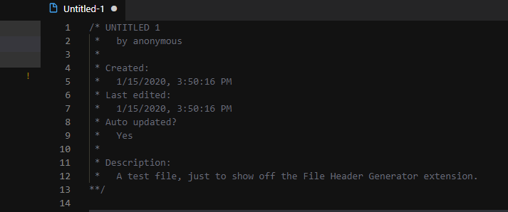

# File Header Generator

The File Header Generator extension aims to quickly generate readable headers for several programming languages. Additionally, it also automatically updates the last edited time.

## Features

The File Header Generator generates headers in one, pre-determined lay-out. This layout displays a more readable type of file name, the creator of the file, when the file was created and when the file was edited most recently. Additionally, it also shows a description (see the picture below for an example).

The creation of a new header is really easy. Simply run the command: "Generate Header" from the command palette, type a discription for your file and hit enter. This description can, of course, also be added later on by editing the header manually. Note that when adding the header via the input box, it is automatically hard-wrapped to a total of 79 characters per line.

When the header is generated, it is automatically maintained (i.e., the 'Last Edited' date is updated) every time the file is saved. To stop this behaviour, set 'Auto updated?' to no or remove it altogether.

## Extension Settings

This extension contributes the following settings:

* `file-header-generator.enabled`: Enables or disables this extension.
* `file-header-generator.username`: Set your own name to sign the headers generated with this extension.
* `file-header-generator.searchLines`: Number of lines to search for the Auto Updated and Last Edited fields. More lines means more extensive search on non-updated files, but more lines allows for more complicated headers before the fields can appear.

## Release Notes

See the release notes for each version below.

### 1.0.0

Initial release of the extension.

### 1.0.1

Added Typescript and Javascript support.

### 1.0.2

Extension was now disabled whatever the setting was. Also added notification for when Generate Header is run but the extension isn't enabled.

### 1.0.4

Added CUDA files support.